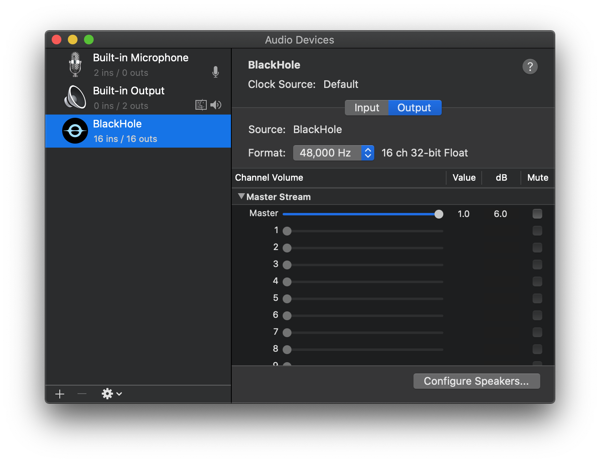

# BlackHole: Virtual Audio Driver

 

BlackHole is a modern MacOS virtual audio driver that allows applications to pass audio to other applications with zero additional latency.

### [Download Installer](https://existential.audio/blackhole/?pk_campaign=github&pk_kwd=readme) 

## Funding
Sponsor: https://github.com/sponsors/ExistentialAudio

Current Funding: $54 per month.

### Goals

- [x] $50 per month. Create installer for BlackHole 2ch that will work along side BlackHole 16ch. (in progress)
- [ ] $100 per month. A new detailed setup guide for each DAW. 

## Table of Contents

- [Features](#features)
- [Easy Installation Instructions](#easy-installation-instructions)
- [Usage Examples]()
- [Advanced Installation Instructions](#advanced-installation-instructions)
- [Uninstallation Instructions](#uninstallation-instructions)
- [Feature Requests](#feature-requests)
- [FAQ](#faq)
- [Wiki](https://github.com/ExistentialAudio/BlackHole/wiki)

## Features
- Supports 16 audio channels.
- Customizable to 256+ channels if you think your computer can handle it.
- Supports 44.1kHz, 48kHz, 88.2kHz, 96kHz, 176.4kHz, and 192kHz sample rates.
- No additional driver latency. 
- Works on macOS 10.10+ including macOS 10.15 Catalina

## Easy Installation Instructions
1. [Download Installer](http://existential.audio/blackhole/)
2. Close all running audio applications
3. Open and install package

BlackHole is also available using `brew cask install blackhole`

For more details visit https://github.com/ExistentialAudio/BlackHole/wiki/Installation

Visit the [Wiki](https://github.com/ExistentialAudio/BlackHole/wiki) for application specific setup.        

## Usage Examples
### Record System Audio
1. [Setup Multi-output Device](https://github.com/ExistentialAudio/BlackHole/wiki/Multi-Output-Device)
2. In `Audio Midi Setup`->`Audio Devices` Right-click on the newly created Multi-output and select "Use This Device For Sound Output"
3. Open digital audio workstation (DAW) such as GarageBand and set input device to "BlackHole" 
4. Set track to input from channel 1-2
5. Play audio from another application and monitor or record in your DAW.

### Route Audio Between Applications
1. Set output driver to "BlackHole" in sending application
2. Output audio to any channel
3. Open receiving application and set input device to "BlackHole" 
4. Input audio from the corresponding output channels

## Advanced Installation Instructions
1. Build driver in Xcode
2. Copy BlackHole.driver to `/Library⁩/Audio⁩/Plug-Ins⁩/HAL`
3. Restart CoreAudio with terminal command `sudo launchctl kickstart -kp system/com.apple.audio.coreaudiod`

## Uninstallation Instructions
1. Delete BlackHole.driver by running `rm -fr /Library/Audio/Plug-Ins/HAL/BlackHole.driver` NOTE: The directory is `system/Library` not `user/Library`
2. Restart CoreAudio with terminal command `sudo launchctl kickstart -kp system/com.apple.audio.coreaudiod`

Need more help? [Visit the wiki.](https://github.com/ExistentialAudio/BlackHole/wiki/Uninstallation)

## Feature Requests

If you are interested in any of the following features please leave a comment in the linked issue. To request a features not listed please create a new issue.

- [Sync Clock with other Audio Devices](https://github.com/ExistentialAudio/BlackHole/issues/27)
- [Output Blackhole to other Audio Device](https://github.com/ExistentialAudio/BlackHole/issues/40)
- [Add Support for AU Plug-ins](https://github.com/ExistentialAudio/BlackHole/issues/18)
- [Inter-channel routing](https://github.com/ExistentialAudio/BlackHole/issues/13)
- [Record Directly to File](https://github.com/ExistentialAudio/BlackHole/issues/8)
- [Configuration Options Menu](https://github.com/ExistentialAudio/BlackHole/issues/7)
- [Support for Additional Bit Depths](https://github.com/ExistentialAudio/BlackHole/issues/42)

## FAQ

### Why isn't BlackHole showing up in the Applications folder?
BlackHole is an audio interface driver. It only shows up in `Audio MIDI Setup`, `Sound Preferences`, or other audio applications.

### How can I listen to the audio and use BlackHole at the same time?
[Setup a Multi-Output Device](https://github.com/ExistentialAudio/BlackHole/wiki/Multi-Output-Device)

### How can I change the volume of a Multi-Output device?
Unfortunately macOS does not support changing the volume of a Multi-Output device but you can set the volume of individual devices in Audio MIDI Setup. 

### How can I use BlackHole with Audacity in Catalina?
Audacity is not compatible with Catalina. But there might be a [work around](https://www.audacityteam.org/macos-10-15-catalina-is-not-yet-supported-by-audacity/).

### Why is nothing is playing through BlackHole? 
- Check `System Preferences` -> `Security & Privacy` -> `Privacy` -> `Microphone` to make sure your digital audio workstation (DAW) has microphone access. 

- Check that the volume is all the way up on BlackHole input and output in ``Audio Midi Setup``.

- If you are using a multi-output device, due to issues with macOS the Build-in Output must be enabled and listed as the top device in the Multi-Output. https://github.com/ExistentialAudio/BlackHole/wiki/Multi-Output-Device#4-select-output-devices

### Where is `/Library/Audio/Plug-Ins/HAL/`?

Chances are you are looking in `~/Library/` or `user/Library/` instead of `/Library`.  

### Can I integrate BlackHole into my app?
BlackHole is licensed under GPL-3.0. You can use BlackHole as long as your app is also licensed as GPL-3.0. For all other applications contact me directly at devinroth@existential.audio.
